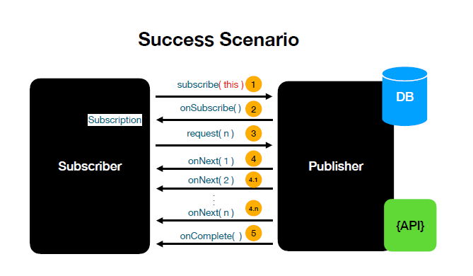
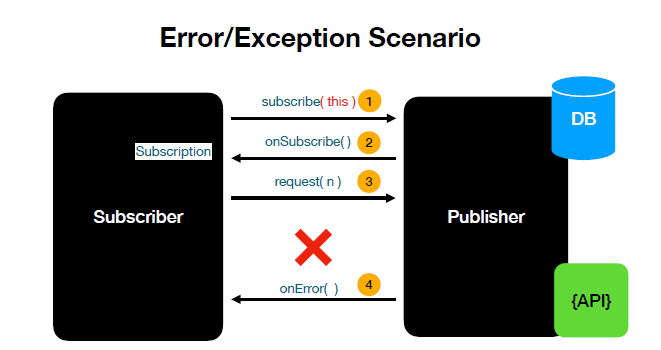

# Reactive Programming

What is Reactive programming? 
- Reactive programming is a new programming paradigm. 
- Asyn and non blocking
- Data flows as event/messaging stream
- Functional Style codes
- BackPressure On Data Streams.
- Push-pull based data flow model request(2) -> onNext()
```
1. App makes a call to DB and immediately the calling thread is 
removed to do useful work.
2. Another thread send from the app to the DB behind the scene
3. Once the query execution and the result set are available
the data are send in stream in a sub sequenonNext()...
4. Once returned all data onComplete() is called.  
```

When to use reactive programing? 
- Use Reactive programming when there is need to build and 
support high load with the available resources.
- App that needs to support 400 TPS

## Reactive App Architecture. 
- Handle request using non blocking style.
  - Netty is a non blocking Server uses Event Loop Model. Instead of 
  single thread/request.
- Using Project Reactor for writing non-blocking programming
- Spring WebFlux uses the Netty and Project Reactor for building
 non-blocking or reactive APIs.
## Reactive Streams 
- It's a specification written by engineers from Lightblend, NetFlix, VmWare(Pivotal)
- Four Interfaces
  - Publisher
  - Subscriber
  - Subscription
  - Processor

**Publisher**

```kotlin
public interface Publisher<T> {
    public void subscribe(Subscriber<? super T> s);
}
Publisher represents the DataSource
• Database
• RemoteService etc.,
```


**Subscriber**
```
public interface Subscriber<T> {

    public void onSubscribe(Subscription s);
    public void onNext(T t);
    public void onError(Throwable t);
  
    public void onComplete();
}
```
**Subscription**
```kotlin
public interface Subscription {
    public void request(long n);
public void cancel();
}
Subscription is the one which connects the app and 
```
**Processor**
Not really used in the day to day cases.
```java
public interface Processor<T, R> extends Subscriber<T>, Publisher<R> {
}
```
• Processor extends Subscriber and Publisher
• Processor can behave as a Subscriber and Publisher
• Not really used this on a day to day basis

## Reactive Success Scenario


## Reactive failure Scenario. 

- Exceptions are treated like the data
- The Reactive Stream is dead when an exception is
  thrown
What is the limitation of Restful API/Spring MVC ?
- Thread pool size of Embedded tomcat in Spring MVC’s is 200
- We can increase the thread pool size based on certain limitations. 
- Thread is expensive and can take up to 1 MB of heap space.
- More threads means more memory consumptions and less space for actual processing

what is NonBlocking or Reactive RestFul API ?
- A Non-Blocking or Reactive RestFul API has the behavior of providing end to
end non-blocking communication between the client and service
- Thread involved in handling the httprequest and httpresponse is not blocked at all

## Project Reactor
- Project Reactor is a reactive library that implement Reactive Stream Specifications(Publisher, Subscriber, 
  Subscribe..)
- Spring WebFlux uses Project Reactor by default

## To learn how to write reactive programming
**Flux & Mono**
- Flux and Mono is a reactive type that impl Ractive Streams specification
- Flux and Mono is part of the **reactor-core** module.
- Flux is a reactive type to represent a list 0 to N elements.
- Mono is a reactive type to represent  0 to 1 element.
- 

- [Project Reactor Reference Guide](https://projectreactor.io/docs/core/release/reference/)
    - covers Mono and Flux creation
    - Reactive library interfaces(publisher, subscriber, subscription, processor)
- [Project Reactor Learning Materials](https://projectreactor.io/learn)
    - Get Started with Reactive Programming in Spring
    - Get Reactive with Project Reactor and Spring 5

## Reactor type
- [Flux](https://projectreactor.io/docs/core/release/api/reactor/core/publisher/Flux.html)
- [Mono](https://projectreactor.io/docs/core/release/api/reactor/core/publisher/Mono.html)

## Project Setup
1. Checkout the project from [reactive-spring-webflux.git](https://github.com/RajasekarVadivelu/reactive-spring-webflux.git)
2. Import in IntellJ
3. Enable Lombok (Settings->Annotation processor)

### Creating Reactor type
- `Flux.fromIterable(List<T>)`
- `Mono.just(T)`
### consuming Reactor type
- `Flux.subscribe(T -> T)`
- `Mono.subscribe(T -> T)`

### Testing Reactive type using reactor-test library
- Use A StepVerifier provides a declarative way of creating a verifiable script for an async Publisher sequence,
by expressing expectations about the events that will happen upon subscription.
 ```java

Flux nameFlux = Flux.fromIterable("Alex", "Ben", "Charlie");

  StepVerifier.create(fluxAndMonoGeneratorService.nameFlux())
   //        .expectNext("Alex", "Ben", "Charlie");
   .expectNextCount(3)
   .verifyComplete();
```

## Transform data
- `map()`: tranform from one form to another form  1-1 (T to V)
- `flatMap`: tranform 1-N (T to *),  Async in nature so (order is not preserved). Useful to flatten the obj that contains another Mono/Flux
- `concatMap`: Work Similar to flatMap. ConcatMap operator preserves the ordering sequence of the reactor streams. By 
  take more time compared to the flatMap
- `flatMapSequential`. Fill fulls the drawbacks of flatMap and concatMap (i.e) (order is preserved with no execution 
  time lag).

> When you have a need to transform Mono to Mono then use flatMap, If Mono to Flux then use flatMapMany

### flatMap() in Mono to mono transformation
- Use it when the transformation returns a mono (e.g)
- Returns a `Mono<T>`
- Use flatMap if the transformation involves making a REST API call or any kind.
  of functionality that can be done async.
- `Mono FlatMap`
  ```java
    public Mono<List<String>> nameMono_flatMap(String name) {
        return Mono.just(name)
                .map(String::toUpperCase)
                .flatMap(this::splitStringMono).log();
    }
   
   Mono<List<String>> splitStringMono(String value) {
    var charArray = value.split("");
    return Mono.just(List.of(charArray));
   }
  ```  
### flatMapMany() in Mono (Mono to Many transformation)
    - **When Mono transformation returns a Flux type then use flatMapMany()**
  ```java
    public Flux<String> nameMono_flatMapMany(String name) {
        return Mono.just(name)
                .map(String::toUpperCase)
                .flatMapMany(this::splitStringWithDelay).log(); //Flux <of A, L, E, X>
    }

      void nameMono_flatMapMany() {
        Flux<String> input = fluxAndMonoGeneratorService.nameMono_flatMapMany("alex");
        StepVerifier.create(input).expectNext("A","L","E","X")
                .verifyComplete();
    }

  ```

### transform()
- Nothing fancy here moving the common functionality to a Functional interface and used it across the project
- Used to transform from one type to another type.
- Accept **Function Functional interface**
  - Function Functional interface got released as part of Java 8
  - Input publisher - (Mono or Flux)
  - Output publisher - (Mono or Flux)
  
You extract the common functionality and assign it to a Function variable like the below one and use transform
with the function variable. 

    ```java
        public Flux<String> nameFlux_transform() {
        //Creating a function functional interface
          Function<Flux<String>, Flux<String>> fluxFunction = name -> name.filter(s -> s.length() > 3)
                  .map(String::toUpperCase);
        
          return Flux.fromIterable(List.of("Alex", "Ben", "Charlie"))
                  .transform(fluxFunction)
                 .log();
      }
    ```
     
### defaultIfEmpty() or switchIfEmpty()
- It is not mandatory for a datasource to emit data all the time
- Use defaultIfEmpty() or switchIfEmpty() when no data emit

#### defaultIfEmpty()
- Returning the raw type like <String>
```java   
 
         Flux<String> fluxNames = Flux.fromIterable(List.of("Alex", "Ben", "Chole"))
                .filter(s -> s.length() > 6)
                .map(String::toUpperCase)
                .defaultIfEmpty("default") 
                .log(); 
      //Output default removing defaultIfEmpty will throw error          
```
#### switchIfEmpty()
- Returning the Flux 
```java   
   //Creating a function functional interface
        Function<Flux<String>, Flux<String>> fluxFunction = name -> name.filter(s -> s.length() > length)
                .map(String::toUpperCase);

        Flux<String> defaultFlux = Flux.just("default").transform(fluxFunction);

        return Flux.fromIterable(List.of("Alex", "Ben", "Charlie"))
                .transform(fluxFunction)
                .switchIfEmpty(defaultFlux)
                .log(); 
```
## Introduction to combining reactive stream
`Combining Flux & Mono`

### **concat() and concatWith()**
- Used to combine two reactive stream in to one.
- Concatenation of Reactive Streams happens in a sequence
    - First one is subscribed first and completes
    - Second one is subscribed after that and then completes
- **Flux.concat(flux1, flux2)** - static method and available (only) in Flux
- **flux1.concatWith(flux2)** - Instance method in Flux and Mono
- concatWith in mono returns the flux
- Both of these operators works similarly.

```java
var flux1 = Flux.just("A", "B", "C")
var flux2 = Flux.just("D", "E");
//Returns A, B, C, D, E
Flux.concat(flux1, flux2);
flux1.concatWith(flux2); //Using the instance method

var mono1 = Mono.just("A")
var mono2 = Mono.just("D");
//Returns A, B, C, D, E
//Returns Flux.       
Flux<String> alphas = mono1.concatWith(mono2);
```

### merge() & mergeWith()
- Used to combine two publisher(Mono, Flux) together
  - _Flux.merge(Flux1, Flux2)_ is  a static method in Flux
  - _mono1.mergeWith(mono2)_ is an instance method in Flux and Mono
>Difference between concat and merge. Unlike concat(sequentially) merge happens in interleaved fashion, both the 
> publisher and subscribed eagerly whereas concat() subscribes to the publishers in a sequence.

### mergeSequential()
- Used to combine two publisher(Mono, Flux) together
- Static method in Flux Flux.mergeSequential(flux1, flux2)
- Even though the publishers and subscribed eagerly the merge happens in a sequence.

### zip() and zipWith()
- Zip `Flux.zip():Flux`
    - Is a static method in Flux
    - Can be used to merge up-to 2 to 8 Publishers(Flux or Mono) in to one

- ZipWith `mono1.zipWith(mono2):Mono`
    - This is an instance method that's part of the Flux and Mono
    - Used to merge two Publishers(_mono/flux_) in to one.
- Publishers are subscribed eagerly
- Waits for all the publishers involved in the transformation to emit one element.
    - Continues until one publisher sends an OnComplete event.

 ##Zip and ZipWith sample
```java

  Flux<String> fluxa = Flux.just("A", "B", "C");
  Flux<String> fluxb = Flux.just("D", "E", "F");
  return Flux.zip(fluxa, fluxb, (first, second) -> first + second); // AD, BE, CF

// Zips three publishers together in this example.
  Flux<String> fluxa = Flux.just("A", "B", "C");
  Flux<String> fluxb = Flux.just("D", "E", "F");
  Flux<String> fluxn = Flux.just("1", "2", "3");
  return Flux.zip(fluxa, fluxb, fluxn).map(t4 -> t4.getT1() + t4.getT2() + t4.getT3()); // AD1, BE2, CF3
// Zip Mono returns Mono
  Mono<String> monoa = Mono.just("A");
  Mono<String> monob = Mono.just("D");
  return monoa.zipWith(monob).map(t1-> t1.getT1() + t1.getT2()); // AD
```
>Note: ZipWith on Mono returns Mono unlike other operators like concatWith and MergeWith which returns Flux 

# Spring WebFlux
- [Home Spring Reactive](https://docs.spring.io/spring-framework/docs/current/reference/html/web-reactive.html)
### Streaming Endpoint
- Streaming Endpoint is a kind of Endpoint which continuously sends updates
  to the clients as the new data arrives
- This concept is similar to Server Sent Events(SSE)
- Easy to implement in Spring WebFlux
- **Examples :** Stock Tickers, Realtime updates of Sports Events


### Bean validation using Validators and Controller Advice
- import gradle dependencies: org.springframework.boot:spring-boot-starter-validation


### How Netty works with Spring WebFlux ?
- Netty server is a non blocking server. It opens a channel between the client and server while processing a request. One thread  handleds the service request and response complete basically one thread
  process a request until another DB call or API call. When we use non blocking reactive library like ReactiveMongoRepository then it creates one separate thread to handle the DB calls up on completion
  OnComplete event is triggered to notify the another to further compose the response and return to the client.


How Netty Works?

Channel represent an open connection between the client and server
Request and Response is sent via the channel.

Channel:
- channel has Channel handlers
    - Accepting the client connection
    - Reading the data as byte from the network to a Java Pbject(Transformation)
    - Writing the data back to the client
- This is all taken care for us by Spring WebFlux.

Channel and EventLoop
- Netty, uses EventLoop model to handle the connecitons in a nonblocking fashion
- An EventLoop is powered by one single thread
    - NodeJs uses the same pattern.
    - Node js has just one thread/one eventloop to handle client requests.
      -Number of Eventloops tp handle the request is equal to no of cores in the machine.


How Channel and EventLoop linked?
- Any time a channel is created it gets assigned to an EventLoop.
- This EventLoop is responsible for handling the diff events that occurs in the lifetime of a channel.

Channel Lifecycle
- ChannelUnregistered  Channel is created and its not reg with the Eventloop
- ChannelRegistered    Channel is reg with the Eventloop
- Channel Active       Channel is active and its now possible to send and receive the data
- Channel InActive     Channel is not connected to the client anymore and ready to be closed.

these lifecycle are treated as events in netty and they are executed by EventLoop.
